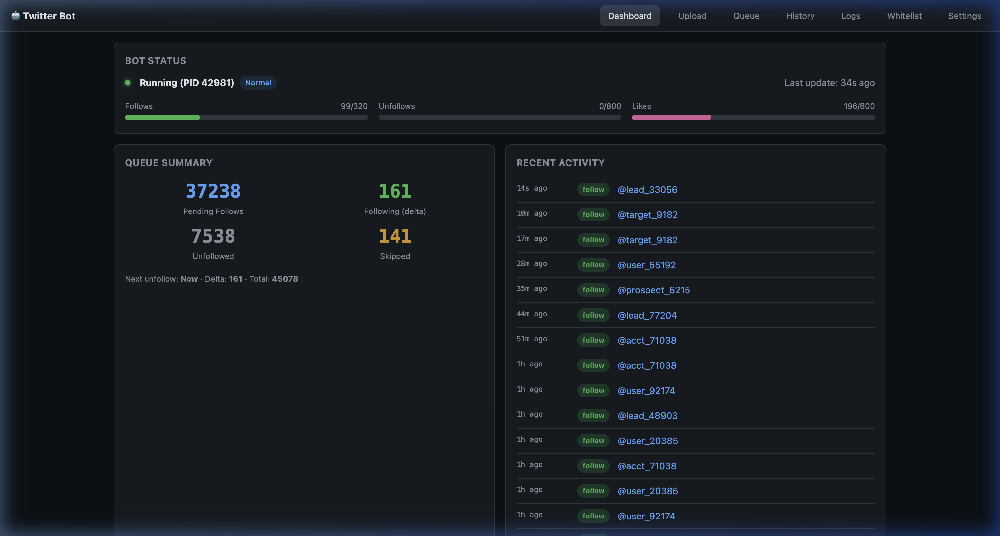

# Server Services

All services running on the home server, organized for deployment on any Ubuntu 22.04 machine.

## Architecture

```
┌─────────────────────────────────────────────────────┐
│                  Ubuntu 22.04 Server                │
│                                                     │
│  :8001  🏠  Server Portal      (Python/Flask)       │
│  :8002  🦙  Ollama GUI         (Vue/Docker)         │
│  :8003  🤖  Twitter Bot Dash   (Python/Flask)       │
│  :8004  🎬  Cast Manager       (Node.js/Express)    │
│  :8005  🎙️  Whisper Transcriber (Python/Flask+GPU)  │
│  :8006  🔍  OCR Engine         (Python/Flask+GPU)   │
│  :8007  📊  System Stats       (Python/Flask)       │
│  :8008  🖼️  ML Image Studio    (Python/Flask+GPU)   │
│                                                     │
│  Services managed by systemd                        │
│  Ollama GUI runs via Docker Compose                 │
└─────────────────────────────────────────────────────┘
```

## Screenshots

### Server Portal — Service Directory


### System Stats — Live Monitoring


### Twitter Bot — Automation Dashboard


### Cast Manager — Media & Torrents


> See each service's README for more screenshots: [Whisper Transcriber](whisper-transcriber/), [OCR Engine](ocr-engine/), [Ollama GUI](ollama-gui/)

## Quick Deploy

```bash
git clone <this-repo>
cd server-services
sudo ./deploy.sh <username> /home/<username>/server-services
```

The deploy script will:
1. Install system packages (Python 3, Node.js 20, Chrome, Docker, ffmpeg, poppler)
2. Install pip/npm dependencies for each service
3. Build and start Ollama GUI via Docker Compose
4. Create and enable systemd units for all services
5. Start everything

## Services

| Port | Service | Tech | Dir |
|------|---------|------|-----|
| 8001 | [Server Portal](server-portal/) | Python/Flask | `server-portal/` |
| 8002 | [Ollama GUI](ollama-gui/) | Vue/Vite + Docker | `ollama-gui/` |
| 8003 | [Twitter Bot Dashboard](twitter-bot/) | Python/Flask + Selenium | `twitter-bot/` |
| 8004 | [Cast Manager](cast-manager/) | Node.js/Express | `cast-manager/` |
| 8005 | [Whisper Transcriber](whisper-transcriber/) | Python/Flask + CUDA | `whisper-transcriber/` |
| 8006 | [OCR Engine](ocr-engine/) | Python/Flask + CUDA | `ocr-engine/` |
| 8007 | [System Stats](system-stats/) | Python/Flask | `system-stats/` |
| 8008 | [ML Image Studio](image-studio/) | Python/Flask + CUDA | `image-studio/` |

## System Requirements

- **OS:** Ubuntu 22.04 LTS
- **Python:** 3.10+
- **Node.js:** 20.20.0 (via nvm)
- **Docker:** 28+ (for Ollama GUI)
- **GPU:** NVIDIA with CUDA (for Whisper + OCR GPU acceleration)
- **RAM:** 8GB+ recommended (Whisper large-v3 model uses ~3GB VRAM)
- **Disk:** ~1GB extra for ML Image Studio model weights (auto-downloaded)

## Managing Services

```bash
# Check all service status
sudo systemctl status server-portal xb-dashboard cast-manager faster-whisper paddleocr system-stats image-studio

# Restart a service
sudo systemctl restart <service-name>

# View logs
journalctl -u <service-name> -f

# Stop all
for s in server-portal xb-dashboard cast-manager faster-whisper paddleocr system-stats image-studio; do sudo systemctl stop $s; done
```

## Private + Public Repo Workflow

This repository is intended to be your **private source-of-truth**.

To maintain a sanitized public mirror:

1. Add two remotes:
    - `origin` → private repo
    - `public` → public repo
2. Keep secret replacements in `.secrets-filter.txt` (gitignored).
3. Commit normally, then run:

```bash
./sync-repos.sh "your commit message"
```

The sync script pushes private changes to `origin`, then exports a filtered mirror to the public repo.

See [GIT_COMMIT_SYNCING_INSTRUCTIONS.md](GIT_COMMIT_SYNCING_INSTRUCTIONS.md) for full setup.

## Directory Structure

```
server-services/
├── README.md                    ← You are here
├── deploy.sh                    ← Master deploy script
├── .env.example                 ← Environment variable template
├── .gitignore
│
├── server-portal/               ← :8001
│   ├── portal.py
│   ├── services.json
│   ├── requirements.txt
│   ├── server-portal.service
│   └── README.md
│
├── ollama-gui/                  ← :8002
│   ├── src/                     (Vue components)
│   ├── public/
│   ├── nginx/
│   ├── compose.yml
│   ├── Dockerfile
│   ├── package.json
│   └── README.md               (original upstream docs)
│
├── twitter-bot/                 ← :8003 (+ :8001 portal)
│   ├── dashboard.py
│   ├── twitter_bot.py
│   ├── portal.py
│   ├── skip_trenton.py
│   ├── *.py                     (utilities)
│   ├── requirements.txt
│   ├── xb-dashboard.service
│   └── README.md
│
├── cast-manager/                ← :8004
│   ├── server.js
│   ├── db.js
│   ├── package.json
│   ├── public/
│   ├── routes/
│   ├── .env
│   ├── cast-manager.service
│   └── README.md
│
├── whisper-transcriber/         ← :8005
│   ├── server.py
│   ├── static/index.html
│   ├── requirements.txt
│   ├── faster-whisper.service
│   └── README.md
│
├── ocr-engine/                  ← :8006
│   ├── server.py
│   ├── static/index.html
│   ├── requirements.txt
│   ├── paddleocr.service
│   └── README.md
│
└── system-stats/                ← :8007
    ├── server.py
    ├── requirements.txt
    ├── system-stats.service
    └── README.md

└── image-studio/                ← :8008
    ├── server.py
    ├── static/index.html
    ├── requirements.txt
    ├── image-studio.service
    └── README.md
```

## License

MIT — see individual service directories for any upstream license requirements (e.g., Ollama GUI).

