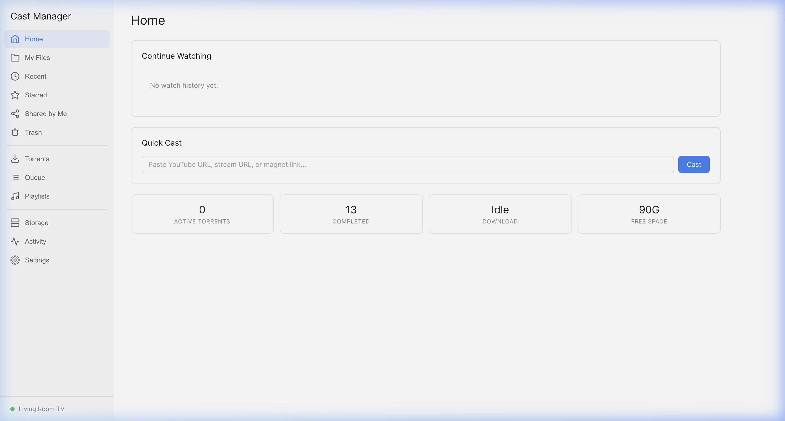

# Cast Manager v3 (:8004)

Video file manager with Chromecast casting, Transmission torrent integration, and remote streaming. Built with Node.js/Express + SQLite.

## Screenshots

### Home — Quick Cast & Torrent Status
File browser with one-click Chromecast casting, torrent integration, and storage overview.



## How It Works

- Express server manages a video library from the downloads directory
- Integrates with Transmission daemon for torrent management
- Casts videos to Chromecast devices via `catt`
- Supports transcoding for incompatible formats via ffmpeg
- Remote streaming with token-based auth
- SQLite database for video metadata and watch history

## Dependencies

```
Node.js v20.20.0 (via nvm)
npm packages: see package.json

System services:
  - Transmission daemon (torrent client)
  - catt (Chromecast CLI tool — pip install catt)
  - ffmpeg (video transcoding)
  - SSH access for remote file operations
```

### System packages (Ubuntu 22.04)

```bash
# Node.js via nvm
curl -o- https://raw.githubusercontent.com/nvm-sh/nvm/v0.39.7/install.sh | bash
nvm install 20.20.0

# System deps
sudo apt install -y ffmpeg transmission-daemon
pip3 install catt

# Install npm packages
cd cast-manager
npm install
```

## Environment Variables (.env)

```
SSH_HOST=your-server-ip
SSH_USER=your-user
SSH_PASSWORD=<your-password>
TRANSMISSION_USER=transmission
TRANSMISSION_PASS=<your-password>
DOWNLOAD_DIR=/home/your-user/watch_list
CHROMECAST_NAME=Living Room TV
CATT_PATH=/home/your-user/.local/bin/catt
PORT=8004
NODE_ENV=production
PUBLIC_URL=
STREAM_TOKEN_EXPIRY_HOURS=24
TRANSCODE_CACHE_DIR=/tmp/cast_manager_cache
TRASH_DIR=/home/your-user/.cast_manager/trash
```

## Files

| File | Purpose |
|------|---------|
| `server.js` | Express app — API + SSE + streaming |
| `db.js` | SQLite database layer |
| `package.json` | npm dependencies |
| `public/` | Frontend HTML/CSS/JS |
| `routes/` | Express route modules |
| `deploy.sh` | Deployment helper script |
| `.env` | Environment configuration |

## Run Locally

```bash
npm install
node server.js
# Serves on http://0.0.0.0:8004
```
