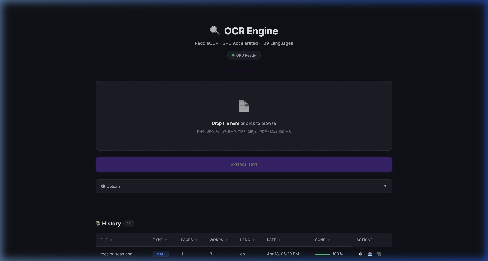
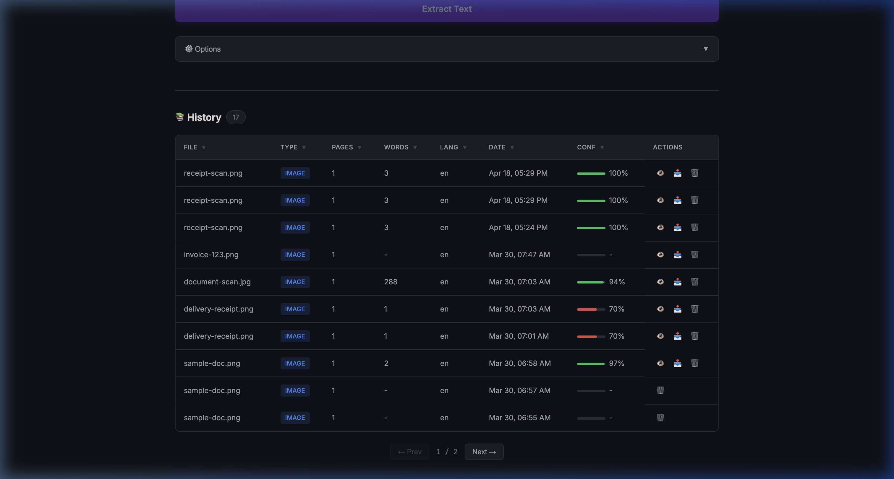

# OCR Engine (:8006)

Web UI for image & PDF text extraction using PaddleOCR. Supports 109 languages with GPU acceleration.

## Screenshots

### Upload & Extract
Drag-and-drop file upload with GPU status indicator and one-click text extraction.



### Extraction History
Sortable history table showing file type, word count, language, confidence scores, and result actions.



## How It Works

- Flask server with embedded HTML UI in `static/index.html`
- Uses PaddleOCR for text detection and recognition
- Converts PDFs to images via `pdf2image` (requires poppler)
- Stores job state in SQLite (`jobs.db`, auto-created)
- Results stored in `results/` directory (auto-created)

## Dependencies

```
Python 3.10+
NVIDIA GPU with CUDA support (optional, CPU works too)
poppler-utils (for PDF page rendering)

pip packages:
  flask==3.1.2
  flask-cors==6.0.2
  paddleocr==2.9.1
  paddlepaddle-gpu==2.6.2   # or paddlepaddle for CPU-only
  pillow==12.1.0
  pdf2image==1.17.0
  Werkzeug==3.1.5
```

### System packages (Ubuntu 22.04)

```bash
sudo apt install -y poppler-utils
pip3 install -r requirements.txt
```

## Files

| File | Purpose |
|------|---------|
| `server.py` | Flask app — API + OCR processing |
| `static/index.html` | Frontend UI |
| `jobs.db` | SQLite job database (auto-created at runtime) |
| `uploads/` | Uploaded files (auto-created at runtime) |
| `results/` | OCR output files (auto-created at runtime) |

## Run Locally

```bash
pip3 install -r requirements.txt
python3 server.py
# Serves on http://0.0.0.0:8006
```

## Original Deployment Location

```
/opt/paddleocr-ui/
```
