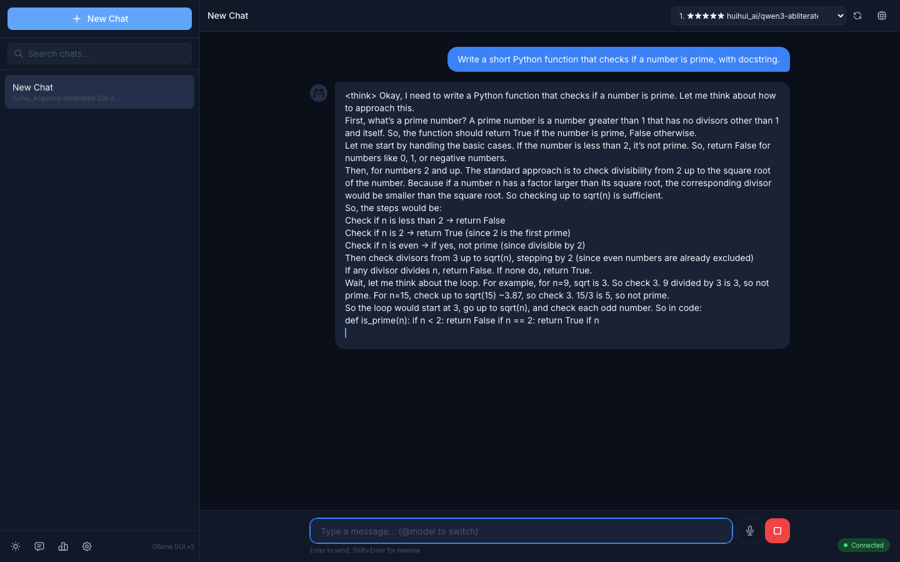
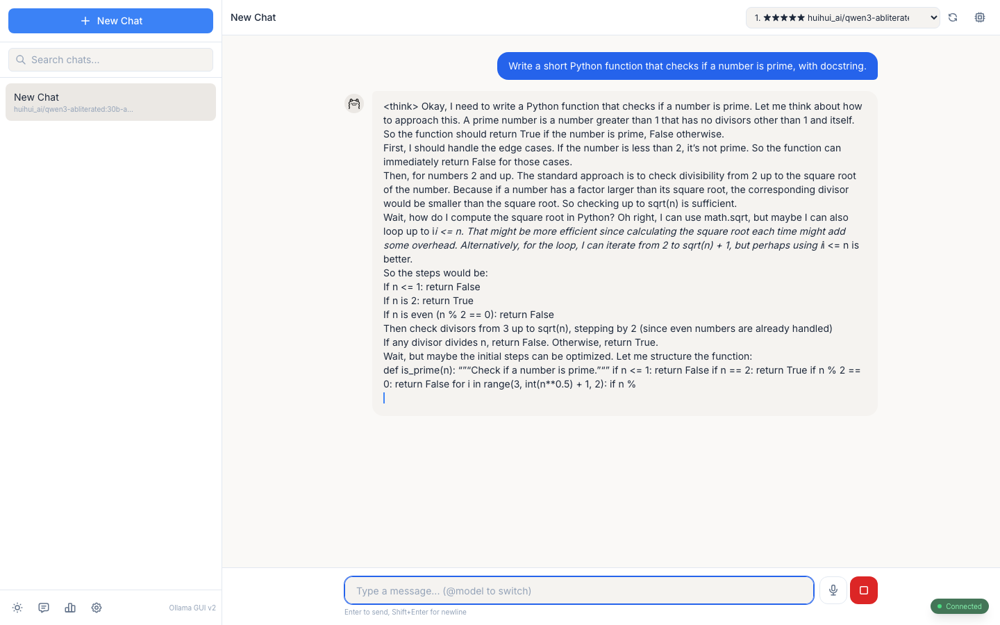
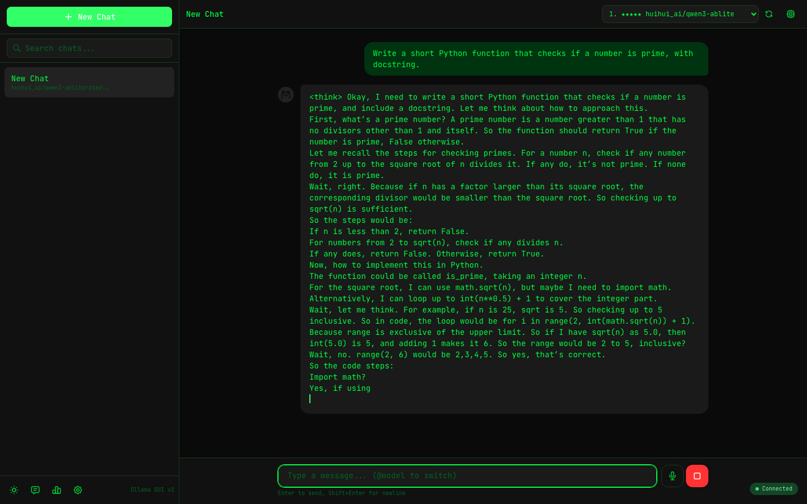
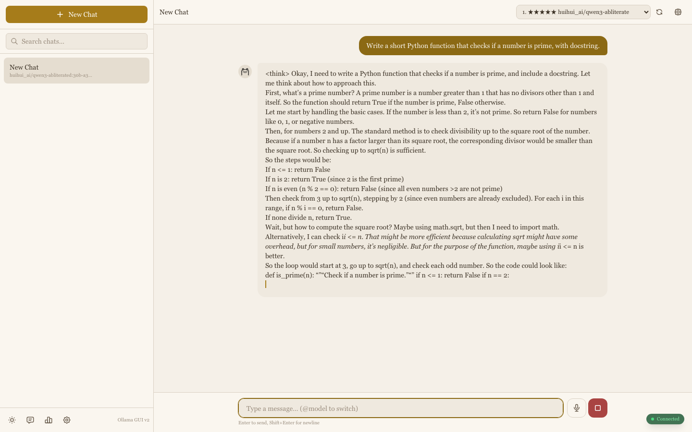
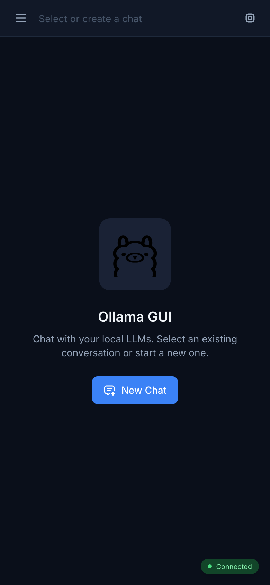
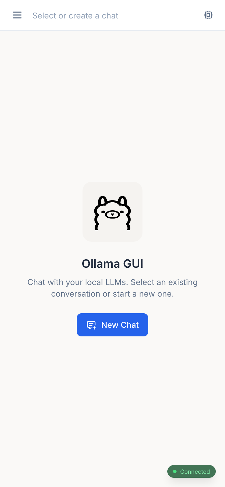

# Ollama GUI v2

A modern, feature-rich web interface for chatting with local LLMs through [Ollama](https://ollama.ai).



## Features

- **Chat Management** -- Create, rename, delete, and search conversations with full CRUD support
- **Streaming Responses** -- Real-time token streaming with stop/cancel support
- **Model Management** -- Pull, delete, and organize models with star rankings for favorites
- **5 Theme Presets** -- Switch between built-in color themes using CSS custom properties
- **Markdown Rendering** -- Full markdown support with syntax-highlighted code blocks via highlight.js
- **Think Block Support** -- Collapsible display of model reasoning/thinking blocks
- **Keyboard Shortcuts** -- Navigate and control the app without leaving the keyboard
- **Progressive Web App (PWA)** -- Installable on desktop and mobile
- **Global Search** -- Search across all conversations from the sidebar
- **Statistics** -- Token counts and usage statistics per conversation
- **Bookmarks** -- Bookmark important messages for quick reference
- **Image Support** -- Attach images for vision-capable models (LLaVA, etc.)
- **Import/Export** -- Back up and restore conversations as JSON
- **Responsive Mobile-First Design** -- Fully usable on phones, tablets, and desktops

## Quick Start

### Prerequisites

1. Install [Ollama](https://ollama.ai/download) and pull at least one model
2. Install [Node.js](https://nodejs.org/) (v18+)

### Local Development

```bash
# Make sure Ollama is running
ollama serve

# Clone and start the GUI
git clone <repo-url>
cd ollama-gui
npm install
npm run dev
```

The dev server starts at **http://localhost:8081** and proxies API requests to Ollama at `localhost:11434`.

To disable the built-in proxy (e.g., when pointing at a remote Ollama instance):

```bash
VITE_NO_PROXY=true npm run dev
```

### Production Build

```bash
npm run build
```

The output in `dist/` is a static site that can be served by any web server.

## Docker Deployment

The included `compose.yml` runs both the GUI and an Ollama instance together:

```bash
docker compose up -d
```

- GUI is available at **http://localhost:8081**
- Ollama API is exposed on port **11435** (mapped from container port 11434)

To stop:

```bash
docker compose down
```

To pull additional models inside the container:

```bash
docker exec -it ollama bash
ollama pull deepseek-r1:7b
```

If you have an NVIDIA GPU, uncomment the `deploy.resources` section in `compose.yml` to enable GPU passthrough.

## Screenshots

### Themes

| Default Dark | Default Light |
|:---:|:---:|
|  |  |

| Hacker | Paper |
|:---:|:---:|
|  |  |

### Mobile

| Dark | Light |
|:---:|:---:|
|  |  |

## Tech Stack

| Layer         | Technology                                                    |
|---------------|---------------------------------------------------------------|
| Framework     | [Vue 3.5](https://vuejs.org/) with Composition API           |
| Build Tool    | [Vite 6](https://vitejs.dev/)                                |
| Language      | [TypeScript 5.7](https://www.typescriptlang.org/) (strict)   |
| State         | [Pinia 2](https://pinia.vuejs.org/)                          |
| Styling       | [Tailwind CSS 3.4](https://tailwindcss.com/)                 |
| Database      | [Dexie 4](https://dexie.org/) (IndexedDB wrapper)            |
| Markdown      | [markdown-it](https://github.com/markdown-it/markdown-it) + [highlight.js](https://highlightjs.org/) |
| Utilities     | [VueUse](https://vueuse.org/), [date-fns](https://date-fns.org/) |
| Icons         | [@tabler/icons-vue](https://tabler.io/icons)                 |
| Container     | Docker + Nginx (production)                                   |

## Credits

Forked from [HelgeSverre/ollama-gui](https://github.com/HelgeSverre/ollama-gui). Original design inspired by [LangUI](https://www.langui.dev/).

## License

Released under the [MIT License](LICENSE.md).
