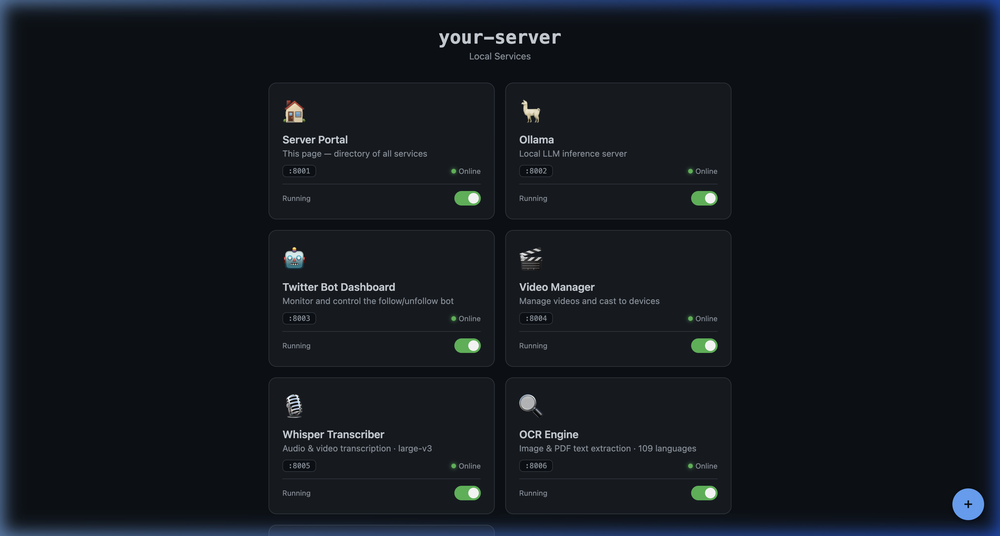

# Server Portal (:8001)

Single-page Flask dashboard showing all services running on this machine. Provides live status checks via TCP probe and radio controls for starting/stopping mapped systemd services.

## Screenshots

### Service Dashboard
All services at a glance — live status indicators, port badges, and start/stop radio controls. VLC is shown as a greyed-out non-clickable listener indicator.



## How It Works

- Reads service definitions from `services.json`
- Probes each port to determine online/offline status
- Inline HTML UI (no separate template files)
- Can start/stop services via systemctl commands, prompting for a sudo password when required

## Dependencies

```
Python 3.10+
flask==3.1.2
```

## Files

| File | Purpose |
|------|---------|
| `portal.py` | Main Flask app (serves HTML + API) |
| `services.json` | Service definitions (name, port, icon, color) |

## Run Locally

```bash
pip3 install -r requirements.txt
python3 portal.py --port 8001
```

## Systemd

```bash
# Copy and edit the service file
sudo cp server-portal.service /etc/systemd/system/
# Edit __USER__ and __INSTALL_DIR__ placeholders
sudo systemctl daemon-reload
sudo systemctl enable --now server-portal
```
