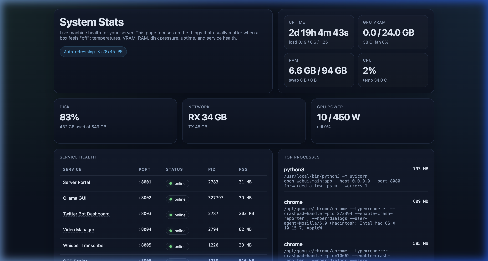
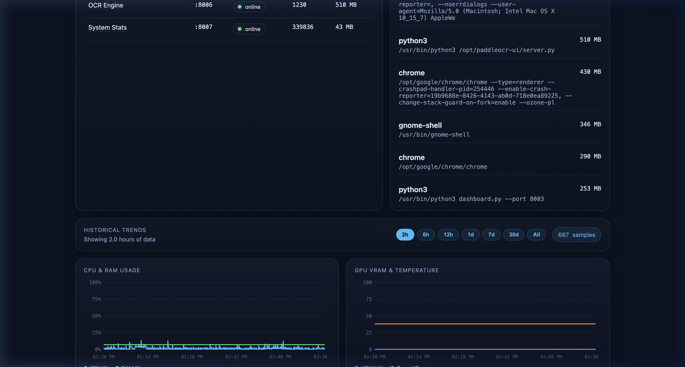

# System Stats (:8007)

Live system monitoring dashboard showing CPU, GPU, RAM, disk usage, service health, and the full process list. Includes historical data stored in SQLite.

## Screenshots

### Dashboard Overview
Live metrics cards for uptime, GPU VRAM, RAM, CPU, disk, network, and GPU power — with auto-refresh and service health table.



### Service Health & Historical Trends
Per-service status with PID and memory, plus CPU/RAM and GPU VRAM/temperature charts over time.



## How It Works

- Flask server with inline HTML/CSS/JS dashboard
- Uses `psutil` for CPU/RAM/disk metrics
- Uses `nvidia-smi` subprocess for GPU metrics (NVIDIA only)
- Checks all service ports for online/offline status, including X-Bot, VLC, and Proton VPN
- Lists all processes sorted by resident memory usage
- Stores historical metrics in SQLite (`stats_history.db`, auto-created)

## Dependencies

```
Python 3.10+
nvidia-smi (for GPU monitoring — comes with NVIDIA drivers)

pip packages:
  flask==3.1.2
  psutil==7.2.1
```

### System packages (Ubuntu 22.04)

```bash
pip3 install -r requirements.txt
# nvidia-smi is available if NVIDIA drivers are installed
```

## GPU Troubleshooting

The dashboard exposes `gpu_error` from `nvidia-smi` when GPU metrics cannot be read. If it reports `Driver/library version mismatch`, compare the loaded kernel module with the installed DKMS module:

```bash
cat /proc/driver/nvidia/version
modinfo nvidia | grep '^version:'
nvidia-smi
```

After an NVIDIA package update, a reboot is usually required so the running kernel loads the newly installed module.

If a reboot is not possible yet, the monitor can temporarily use an extracted compatibility bundle at `.nvidia-compat/<loaded-version>/root` containing the matching `nvidia-smi` binary and `libnvidia-ml.so`. Normal system `nvidia-smi` is still preferred whenever it works.

## Files

| File | Purpose |
|------|---------|
| `server.py` | Flask app — API + inline dashboard |
| `stats_history.db` | SQLite metrics history (auto-created at runtime) |

## Run Locally

```bash
pip3 install -r requirements.txt
python3 server.py --port 8007
```
