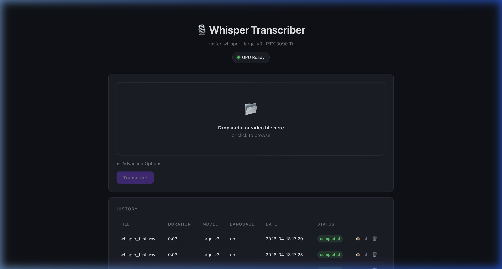

# Whisper Transcriber (:8005)

Web UI for audio & video transcription using Faster Whisper (large-v3 model). Upload files, get transcriptions with timestamps. Uses GPU acceleration via CUDA.

## Screenshots

### Transcription Interface
Drag-and-drop upload with GPU status, advanced model options, and job history with download links.



## How It Works

- Flask server with embedded HTML UI in `static/index.html`
- Uses `faster-whisper` library (CTranslate2 backend) for fast GPU inference
- Stores job state in SQLite (`jobs.db`, auto-created)
- Uploaded files go to `uploads/` directory (auto-created)

## Dependencies

```
Python 3.10+
NVIDIA GPU with CUDA support
CUDA toolkit + cuDNN (for GPU acceleration)
ffmpeg (for audio extraction from video files)

pip packages:
  flask==3.1.2
  flask-cors==6.0.2
  faster-whisper==1.2.1
```

### System packages (Ubuntu 22.04)

```bash
sudo apt install -y ffmpeg
pip3 install -r requirements.txt
# For GPU: pip3 install nvidia-cublas-cu11 nvidia-cudnn-cu11  (or matching CUDA version)
```

## Files

| File | Purpose |
|------|---------|
| `server.py` | Flask app — API + job management |
| `static/index.html` | Frontend UI |
| `jobs.db` | SQLite job database (auto-created at runtime) |
| `uploads/` | Uploaded media files (auto-created at runtime) |

## Run Locally

```bash
pip3 install -r requirements.txt
python3 server.py
# Serves on http://0.0.0.0:8005
```

## Original Deployment Location

```
/opt/faster-whisper-ui/
```
